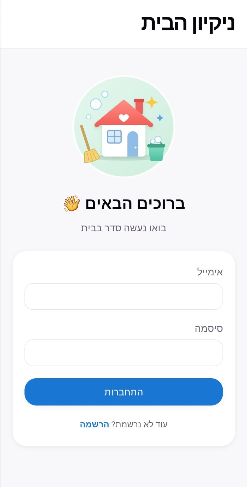
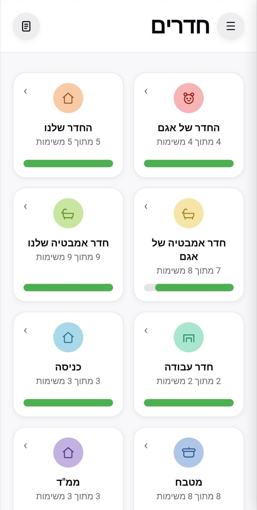

# Home Cleaning API

REST API for a household cleaning app. Members of a household share rooms and recurring cleaning tasks, mark tasks as done, and get a push notification when someone else completes one.

## Live demo

- **App:** [home-cleaning-ui.vercel.app](https://home-cleaning-ui.vercel.app/)

> The API runs on Render's free tier, which sleeps when idle. The first request after a quiet period can take up to a minute while the server wakes up.

<p>
  
  
</p>


## Tech stack

- **Runtime:** Node.js 22, Express 5
- **Database:** MongoDB with Mongoose, using transactions for multi-document writes
- **Cache / rate limiting:** Redis
- **Auth:** JWT, role-based authorization, household-level data isolation
- **Notifications:** Web Push (VAPID)
- **Docs:** Swagger / OpenAPI
- **Testing:** Jest, Supertest, mongodb-memory-server (in-memory replica set)
- **CI/CD:** GitHub Actions, deployed to Render after tests pass
- **Local environment:** Docker, Docker Compose

## Run locally with Docker (recommended)

Requires only [Docker Desktop](https://www.docker.com/products/docker-desktop/).

```bash
git clone https://github.com/ronyitz/home-cleaning-api.git
cd home-cleaning-api
docker compose up -d
```

This starts three containers: the API, MongoDB and Redis. No `.env` file is needed.

- API: http://localhost:3001
- Health check: http://localhost:3001/api/health
- Swagger docs: http://localhost:3001/api-docs

Useful commands:

```bash
docker compose up --watch      # live reload: code changes in src/ restart the API
docker compose logs -f api     # follow API logs
docker compose down            # stop (data is kept in a volume)
docker compose down -v         # stop and wipe the local database
```

To enable push notifications locally, create a `.env` file with VAPID keys (see `.env.example`).

## Run locally without Docker

Requires Node.js 22, plus a MongoDB and a Redis instance (local or hosted). MongoDB must run as a replica set, because signup uses transactions. MongoDB Atlas already does; a local standalone server does not.

```bash
npm install
cp .env.example .env    # then fill in the values
npm run dev
```

The API runs on http://localhost:3000.

## Tests

```bash
npm test
```

Tests run automatically on every push and pull request via GitHub Actions.

## API overview

All routes are under `/api`. Full documentation is available in Swagger at `/api-docs`.

| Area | Routes |
|---|---|
| Auth | `POST /auth/signup`, `POST /auth/login`, `GET /auth/verify` |
| Rooms | list, create, update, delete (create/update/delete are admin only) |
| Tasks | list by household or room, create, update, complete, delete |
| Push | `GET /push/vapid-public-key`, `POST /push/subscribe`, `POST /push/unsubscribe` |

All routes except auth require a `Bearer` token. Users only see data from their own household.

## Project structure

```
src/
  config/        Redis client
  controllers/   Request handlers
  middleware/    Auth, validation, rate limiting, error handling
  models/        Mongoose schemas
  routes/        Express routers
  services/      Push notification sending
  app.js         Express app setup
  server.js      Entry point (connects to MongoDB and Redis, starts the server)
tests/           Jest + Supertest tests
scripts/         One-off maintenance scripts
```
